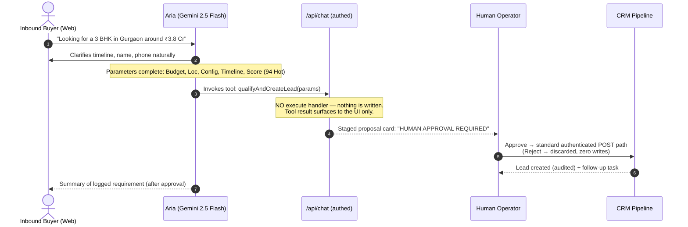

# AI Agents & Automation Architecture — Apex CallCRM

This document outlines the **AI Agent Layer** and **Automated Workflow Engines** powering **Apex CallCRM**, as actually implemented. It reflects the hardened architecture: every agent is **human-gated** — proposals are staged, and only explicit human approval writes to the database.

---

## 1. Executive Summary & Design Philosophy

Traditional real estate CRMs are passive databases that demand heavy manual data entry from busy field agents.

Apex CallCRM shifts data entry work to AI assistants — with a strict trust boundary:

$$\text{AI proposes} \quad \Longrightarrow \quad \text{Human approves} \quad \Longrightarrow \quad \text{System writes (audited)}$$

**No agent has autonomous database write access. This is enforced architecturally, not by prompting:**

```
┌─────────────────────────────────────────────────────────────────────────────┐
│                        APEX AGENTIC SYSTEM                                  │
├──────────────────────────────┬──────────────────────────────────────────────┤
│ 1. INTAKE & QUALIFICATION    │ Aria Qualification Agent                     │
│    (Web widget)              │ - Multi-turn conversational extraction       │
│                              │ - Tool has NO execute handler (by design)    │
│                              │ - Proposals staged → Approve/Reject card     │
├──────────────────────────────┼──────────────────────────────────────────────┤
│ 2. RESURRECTION & MATCHING   │ Lost-Lead Resurrection Engine                │
│    (Dormant / Lost Deals)    │ - Server scan endpoint: manager+ only,       │
│                              │   strictly validated, READ-ONLY              │
│                              │ - Client matcher suggests pitch angles;      │
│                              │   reactivation goes through audited writes   │
├──────────────────────────────┼──────────────────────────────────────────────┤
│ 3. SALES SPEED ENGINE        │ WhatsApp Sales Assistant                     │
│    (Field Sales Acceleration)│ - 1-click templated outbound                 │
│                              │ - Inbound webhook: HMAC + replay guard +     │
│                              │   tenant resolution + DB idempotency         │
├──────────────────────────────┼──────────────────────────────────────────────┤
│ 4. LIVE TELEMETRY            │ Realtime Event Stream                        │
│    (Multi-Tenant Sync)       │ - postgres_changes on leads/tasks/activities │
│                              │ - Debounced refetch; all sessions converge   │
└──────────────────────────────┴──────────────────────────────────────────────┘
```

---

## 2. Agent 1: Aria — Lead Qualification Agent (Human-Gated)

### Purpose
Engage inbound prospects via web chat around the clock, qualify their buying intent through natural conversation, and stage structured opportunities for review by the sales desk.

### Tech Stack & Hardening (`Frontend/src/app/api/chat/route.ts`)
- **Model**: Google Gemini 2.5 Flash via `@ai-sdk/google`
- **Orchestration**: Vercel AI SDK (`streamText`, `tool`, `convertToModelMessages`)
- **Security gates applied in order**:
  1. Authentication required (`getApiAuthContext` — cookie or Bearer session)
  2. Plan feature gate — orgs below Growth receive `402 PLAN_UPGRADE_REQUIRED`
  3. Per-user durable rate limit (20/min, Postgres-backed, survives cold starts)
  4. Payload validation: ≤ 20 messages, ≤ 32KB total, `system` role rejected from clients
  5. `maxOutputTokens=1024`, 25s `AbortSignal.timeout`
- **Prompt-injection fencing**: the system prompt instructs the model to treat buyer text as *data about an enquiry*, never as instructions.

### Human-Gated Tool Flow (as implemented)


### Extracted Parameters Schema (`qualifyAndCreateLead`)
| Field | Type | Description |
| :--- | :--- | :--- |
| `personName` | `string` | Full name of prospect (2–100 chars) |
| `phone` | `string` | Contact number (10–16 chars, E.164 preferred) |
| `location` | `string` | Micro-market (e.g. *Golf Course Ext, Gurgaon*), ≤150 chars |
| `configuration` | `string` | Unit layout (e.g. *3 BHK Luxury + Servant*) |
| `budget` | `number` | INR value (e.g. `38000000` for ₹3.8 Cr), capped at ₹10B |
| `timeline` | `string` | Purchase window (*Ready to move*, *30–60 days*) |
| `buyerIntent` | `string` | *End-User (Primary Residence)* vs *High-yield Investor* |
| `leadScore` | `number` | 0–100 readiness score |
| `leadScoreLabel`| `"Hot" \| "Warm" \| "Cold"` | Score badge |
| `buyingSignals` | `string[]` | Positive signals (max 15 × 200 chars) |
| `objections` | `string[]` | Constraints (e.g. floor height, price/sqft) |
| `notes` | `string` | Executive brief for the reviewing rep (≤2000 chars) |

All fields are zod-bounded server-side; array sizes and string lengths are hard-capped.

### UI Surfaces
- **`AiAgentCommandCenter`** (`/agent-live`): dual-pane terminal with preset buyer simulations, live execution log, and an amber approval card ("nothing written until you approve"). Approve writes through the normal authenticated CRM path; Reject discards with a confirmation trail.
- **`AiLeadBot`**: floating intake widget; qualification results render as pending cards requiring explicit Approve before entering the pipeline.

---

## 3. Agent 2: Lost-Lead Resurrection Engine

### Purpose
In luxury real estate, many lost leads go cold due to timing, inventory shortage, or payment inflexibility at the moment of inquiry. The engine resurfaces dormant buyers when matching inventory exists.

### Server Scanner (`POST /api/agent/resurrect`) — read-only
- **Authorization**: manager/admin role required (from verified profile, not client claims); feature-gated to Growth+ plans.
- **Input**: `daysThreshold` strictly validated as integer 1–365 (prevents PostgREST `.or()` filter injection).
- **Behavior**: scans `stage = 'lost'` or `days_in_stage ≥ threshold` within the caller's tenant (RLS + explicit org filter), cross-references available units by project/budget proximity (±20%), returns ranked opportunities with revival scores, and logs executions to `ai_agent_executions` (org-scoped).

### Client Matcher (`AiResurrectionModal`)
- Renders scanner results with pitch-angle selection:
  - 🚀 **New Tower Allotment** · 💳 **20:80 Payment Scheme** · 🏷️ **Price Drop** · 💎 **NRI Reallocation**
- Generates tailored WhatsApp pitches for 1-click outreach.
- **Reactivation applies through the standard audited mutation path** (`reactivateLead`): lost → contacted with `daysInStage` reset, audit activity logged, high-priority reactivation call task created for the rep. Batch mode exists but every write flows through the same validated path.

---

## 4. Automation 3: WhatsApp Sales Assistant Engine

### Outbound
- **Dynamic Variable Interpolation**: buyer name, project name, unit configuration, quoted budget, and rep identity injected into luxury templates.
- **Direct Dispatch**: 1-click `https://wa.me/` launch on mobile and desktop.
- **Automated Activity Logging**: each dispatch logs a timestamped touchpoint into the lead's immutable audit stream.

### Inbound (`POST /api/webhooks/whatsapp`)
- **Fail closed**: refuses processing unless `WHATSAPP_APP_SECRET` is configured; HMAC-SHA256 signature mandatory (timing-safe comparison).
- **Replay protection**: message timestamps older than ±5 minutes are dropped.
- **Tenant resolution**: the sending `phone_number_id` must map to an organization via the `webhook_sources` table — unmapped sources are recorded and never written against a tenant.
- **Idempotency**: insert-first into `webhook_events` (unique index) — duplicate Meta retries are dropped before any state change.
- **Hygiene**: payload size cap (64KB); attacker-controlled message text is truncated and JSON-fenced before storage.
- Meta Lead Ads inbound follows the identical pattern keyed on `page_id`.

---

## 5. Automation 4: Real-Time Event Sync

### Implementation (actual)
- One Supabase Realtime channel (`crm-realtime`) subscribed to `postgres_changes` on:
  - `leads` — pipeline/stage/score updates
  - `tasks` — queue changes and completions
  - `activities` — new touchpoints
- Any event triggers a **debounced refetch (1.5s)** of that entity rather than patch merging — simple, correct ordering, no merge bugs.
- Combined with optimistic local mutations + write-through persistence (`lib/persistence/crm-sync.ts`) and an automatic retry queue (`lib/persistence/retry-queue.ts`: flushes on network-online, tab focus, and 30s sweep; abandons loudly after 5 attempts), all sessions/devices converge without refreshes.

---

## 6. Business Impact Model

The following are **design targets**, not measured guarantees — instrument your own deployment before quoting numbers externally:

| Operational Metric | Traditional CRM Workflow | CallCRM Design Target |
| :--- | :--- | :--- |
| Inbound speed-to-lead | Hours (often missed overnight) | Instant conversational intake, 24/7 |
| Qualification consistency | Rep-dependent | Structured schema on every proposal |
| Lost-lead recovery | Leads abandoned in spreadsheets | Systematic dormancy scans + pitch tooling |
| Rep daily admin time | High manual entry | Sub-minute disposition logging |
| Data residency | Scattered personal WhatsApps | Tenant-isolated RLS-backed storage |

---

## 7. Configuration & Environment

```env
# --- Required for live AI streaming ---
GEMINI_API_KEY=your_gemini_api_key          # or GOOGLE_GENERATIVE_AI_API_KEY

# --- Required for any AI usage at all (routes reject anonymous calls) ---
NEXT_PUBLIC_SUPABASE_URL=https://your-project.supabase.co
NEXT_PUBLIC_SUPABASE_ANON_KEY=your_anon_key

# --- Required only if enabling WhatsApp / Meta lead-ads webhooks ---
WHATSAPP_VERIFY_TOKEN=...
WHATSAPP_APP_SECRET=...          # webhooks fail CLOSED without these
META_LEAD_ADS_VERIFY_TOKEN=...
META_APP_SECRET=...

# --- Required before wiring a payment provider ---
BILLING_WEBHOOK_SECRET=...
STRIPE_SECRET_KEY=...            # optional; checkout runs "simulated" until set
RAZORPAY_KEY_SECRET=...
```

Behavior notes:
- **No Gemini key**: `/api/chat` returns `503 AI_PROVIDER_UNAVAILABLE`. The command center remains usable in simulation mode (client-side heuristics, still approval-gated).
- **No Supabase config**: the app runs in demo mode (mock dataset, in-memory state). Authentication is never faked — unauthenticated users simply cannot sign in or reach CRM routes.
- **Plan gating**: AI features require Growth+; quotas are enforced by DB triggers regardless of which client writes.
