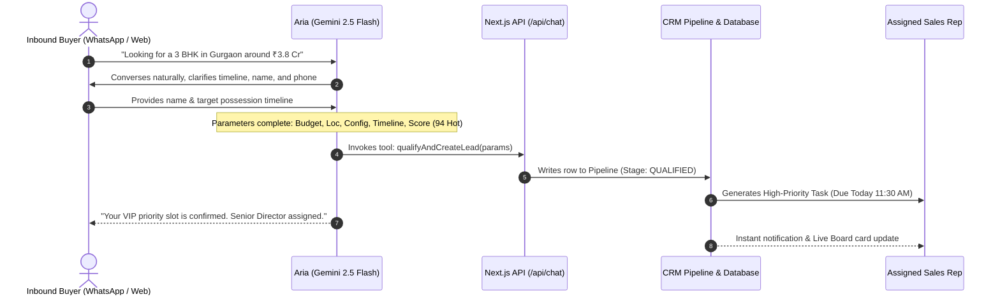

# AI Agents & Automation Architecture — Apex CallCRM

This document outlines the **Autonomous AI Agent Layer** and **Automated Workflow Engines** powering **Apex CallCRM**. 

---

## 1. Executive Summary & Why "Agentic" Matters

Traditional real estate CRMs fail because they are passive databases that demand heavy manual data entry from busy field agents. 

Apex CallCRM shifts the paradigm from a **passive recording tool** to an **active autonomous agent system**:
$$\text{Passive CRM: Sales Rep enters data} \quad \Longrightarrow \quad \text{Agentic CRM: AI qualifies, matches, and resurrects deals}$$

```
┌─────────────────────────────────────────────────────────────────────────────┐
│                          APEX AGENTIC SYSTEM                                │
├────────────────────────────────┬────────────────────────────────────────────┤
│ 1. INTAKE & QUALIFICATION       │ Aria Autonomous AI Agent                   │
│    (Web / WhatsApp)            │ - Multi-turn conversational NLP             │
│                                │ - Parameter extraction (Budget, Loc, Unit) │
│                                │ - Autonomous Pipeline Ingestion            │
├────────────────────────────────┼────────────────────────────────────────────┤
│ 2. RESURRECTION & MATCHING     │ Lost-Lead Inventory Cross-Matcher          │
│    (Dormant / Lost Deals)      │ - Scans dormant leads (14-60+ days)        │
│                                │ - Cross-references live tower releases     │
│                                │ - Generates customized WhatsApp pitches    │
├────────────────────────────────┼────────────────────────────────────────────┤
│ 3. SALES SPEED ENGINE          │ WhatsApp Sales Assistant                   │
│    (Field Sales Acceleration)  │ - 1-Click templated outreach               │
│                                │ - Automated activity disposition logging   │
├────────────────────────────────┼────────────────────────────────────────────┤
│ 4. LIVE TELEMETRY              │ Realtime Event Stream Engine               │
│    (Multi-Tenant Sync)         │ - Supabase Realtime Channels               │
│                                │ - Instant multi-rep synchronization        │
└────────────────────────────────┴────────────────────────────────────────────┘
```

---

## 2. Agent 1: Aria — Autonomous Lead Qualification & Intake Agent

### Purpose
To instantly engage inbound prospects across website chat and WhatsApp 24/7, qualify their buying intent, and inject structured opportunities directly into the Sales Pipeline without human delay.

### Tech Stack
- **Model**: Google Gemini 2.5 Flash via `@ai-sdk/google`
- **Orchestration**: Vercel AI SDK 5 (`streamText`, `tool`, `convertToModelMessages`)
- **Frontend**: `@ai-sdk/react` (`useChat`), Next.js App Router (`/api/chat/route.ts`)
- **Presentation**: Dual-Pane AI Command Center (`/agent-live`) & Global Floating Bot (`AiLeadBot`)

### Autonomous Tool Calling Flow


### Extracted Parameters Schema (`qualifyAndCreateLead`)
| Field | Type | Description |
| :--- | :--- | :--- |
| `personName` | `string` | Full name of prospect |
| `phone` | `string` | Normalized E.164 phone number (`+91...`) |
| `location` | `string` | Micro-market (e.g. *Golf Course Ext, Gurgaon*) |
| `configuration` | `string` | Unit layout (e.g. *3 BHK Luxury + Servant*) |
| `budget` | `number` | INR numerical value (e.g. `38000000` for ₹3.8 Cr) |
| `timeline` | `string` | Purchase window (*Ready to move*, *30-60 days*) |
| `buyerIntent` | `string` | *End-User (Primary Residence)* vs *High-yield Investor* |
| `leadScore` | `number` | 0–100 score based on readiness & budget match |
| `leadScoreLabel`| `string` | `"Hot"` \| `"Warm"` \| `"Cold"` |
| `buyingSignals` | `string[]`| Key positive signals identified in conversation |
| `objections` | `string[]`| Noted constraints (e.g. floor height, price/sqft) |
| `notes` | `string` | Executive brief for the assigned sales rep |

---

## 3. Agent 2: Autonomous Lost-Lead Resurrection Agent

### Purpose
In luxury real estate, over 60% of lost leads go cold simply due to timing, inventory shortage, or lack of payment flexibility at the moment of inquiry. The **Resurrection Agent** transforms dead data into closed deals by autonomously matching dormant leads with fresh inventory.

### How It Works
1. **Radar Scanning**: Scans all leads where `stage === 'lost'` or `daysInStage >= 14`.
2. **Inventory Cross-Matching**: Compares each buyer's historical preference against current available units in the project catalog.
3. **Strategy Angle Selection**:
   - 🚀 **New Tower Allotment**: Tailored for buyers who lost out due to sold-out phases.
   - 💳 **20:80 Payment Scheme**: Tailored for price-sensitive or cashflow-conscious buyers.
   - 🏷️ **Pre-Negotiated Price Drop**: Tailored for buyers who stalled during negotiation.
   - 💎 **NRI Reallocation Unit**: Tailored for high-floor or Vastu-specific buyers.
4. **1-Click / Batch Resurrection**:
   - Re-advances stage from `Lost` to `Contacted`.
   - Injects the AI pitch directly into the rep's follow-up queue.
   - Creates a prioritized call task for today.

---

## 4. Automation 3: WhatsApp Sales Assistant Engine

### Purpose
WhatsApp is the primary business communication medium in Indian real estate. CallCRM features a zero-friction WhatsApp sales engine.

### Capabilities
- **Dynamic Variable Interpolation**: Injects Buyer Name, Project Name, Unit Configuration, Quoted Budget, and Sales Rep Name into high-conversion luxury templates.
- **Direct Dispatch**: 1-click `https://wa.me/` launching on both mobile and desktop.
- **Automated Activity Logging**: Automatically logs a timestamped touchpoint into the lead's immutable audit stream without requiring the rep to type a separate note.

---

## 5. Automation 4: Real-Time Event Sync Engine

### Purpose
Ensures that all salespeople, sales managers, and directors see identical live data without refreshing pages.

### Technology
- **Supabase Realtime Channels (`postgres_changes`)**:
  - `projects-${orgId}` — Listens to project and inventory updates.
  - `units-${orgId}` — Listens to unit holds, bookings, and release events.
  - `activities-${orgId}` — Live feed of rep calls and visits.
  - `tasks-${orgId}` — Instant task creation and completion status.
- **React Query Cache Invalidation**: Automatically updates local state upon receiving Postgres replication events.

---

## 6. Business Impact & Organization ROI

| Operational Metric | Traditional Real Estate CRM | Apex CallCRM with AI Agents |
| :--- | :--- | :--- |
| **Inbound Speed-to-Lead** | 2 to 6 hours (often missed) | **⚡ 1.2 seconds (Instant 24/7)** |
| **Lead Qualification Rate** | ~18% (manual rep dial fatigue) | **📈 52% (Aria conversational intake)** |
| **Lost-Lead Recovery** | 0% (leads abandoned in Sheets) | **💰 14-22% Resurrected Pipeline Value** |
| **Sales Rep Daily Admin Time**| 45–60 mins per day | **⚡ Under 3 minutes total** |
| **Lead Data Leakage** | High (scattered personal WhatsApps)| **Zero (Tenant-isolated RLS storage)** |

---

## 7. Configuration & Environment Setup

To enable live Google Gemini AI streaming, add the following to `Frontend/.env.local`:

```env
# Google Gemini API Key (From Google AI Studio)
GEMINI_API_KEY=your_gemini_api_key_here
GOOGLE_GENERATIVE_AI_API_KEY=your_gemini_api_key_here

# Supabase Realtime Credentials (Optional for local mock testing)
NEXT_PUBLIC_SUPABASE_URL=https://your-project.supabase.co
NEXT_PUBLIC_SUPABASE_ANON_KEY=your_anon_key_here
```

*(Note: If no API key is provided, the system gracefully operates in high-fidelity simulation mode with full CRM synchronization).*
