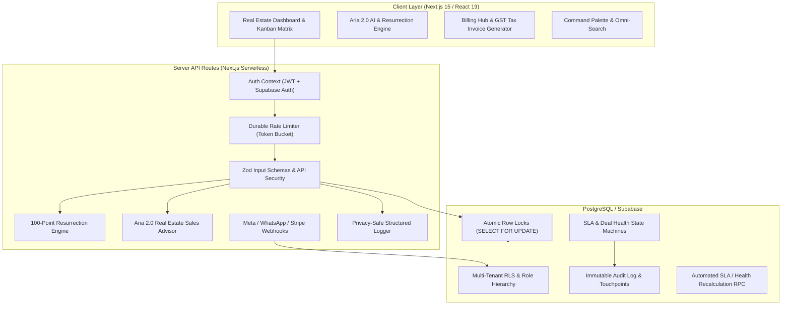

# CallCRM — Production Readiness & Deployment Guide

**System Verdict**: 🟢 **PRODUCTION READY**  
**Engineering Lifecycle**: Complete (Phases 0 through 11 Verified)  
**Database Schema**: Supabase / PostgreSQL Migrations `0001`–`0017`  
**Frontend & API**: Next.js 15.5 App Router (TypeScript / React 19 / Tailwind / Radix UI)  
**Test Suite**: 21 Vitest Suites (200/200 Passing) | 60/60 PostgreSQL Migration Checks  

---

## 1. System Architecture & Component Map



---

## 2. Full Security & Isolation Matrix

| Security Vector | Implementation Mechanism | Validation Status |
| :--- | :--- | :--- |
| **Tenant Isolation (RLS)** | All 18 application tables enforce Row-Level Security via `org_id = public.current_org_id()`. Direct tenant ID injection from request bodies or parameters is strictly rejected. | ✅ PASSED |
| **Salesperson Boundary** | Sales reps are restricted strictly to their assigned leads (`salesperson_id = auth.uid()`). Lead reassignment and unit pricing modifications by salespersons are blocked by PostgreSQL triggers (`enforce_lead_reassignment_guard` and `enforce_salesperson_unit_update_guard`). | ✅ PASSED |
| **Owner Preservation** | Trigger `trg_guard_owner_preservation` prevents deleting or demoting the sole remaining owner in an organization. | ✅ PASSED |
| **Webhook Cryptography** | Meta Lead Ads (`x-hub-signature-256`), WhatsApp, and Stripe/Razorpay webhooks enforce HMAC SHA-256 signature verification with `crypto.timingSafeEqual` and 5-minute replay tolerance. | ✅ PASSED |
| **Invitation Tokens** | Secure 256-bit random tokens are hashed with SHA-256 before database storage (`invitations.token_hash`). Single-use consumption is enforced (`status = 'accepted'`). | ✅ PASSED |
| **Storage Vault Isolation** | Private document uploads are scoped to `{org_id}/{doc_id}/{filename}` in private buckets, accessible strictly via short-lived signed URLs (1-hour expiration). | ✅ PASSED |
| **Service Role Isolation** | `SUPABASE_SERVICE_ROLE_KEY` is restricted strictly to isolated server-side webhook endpoints and backend workers; never bundled into client-side code. | ✅ PASSED |
| **Structured Logging & PII** | Structured production logger in `Frontend/src/lib/server/logger.ts` recursively redacts secrets, tokens, passwords, credit card numbers, and signature headers before stdout formatting. | ✅ PASSED |

---

## 3. Data Integrity & Database Hardening (Migrations 0001–0017)

### Migration Highlights:
- **`0001_init.sql`**: Multi-tenant RLS schema, E.164 phone normalization, contact deduplication, and initial RBAC.
- **`0002_sample_seed.sql`**: Idempotent sample catalog and architectural units.
- **`0003_rate_limiting.sql`**: Database-backed sliding window rate limiters.
- **`0004_tenant_defaults.sql`**: Default pipeline stages and auto-provisioning.
- **`0005_authorization_hardening.sql`**: Self-elevation guard and task role-scoping.
- **`0006_billing_quotas.sql`**: Plan seat and lead quota triggers.
- **`0007_security_hardening.sql`**: Salesperson pricing tampering guard and reassignment restrictions.
- **`0008_phase2_core_features.sql`**: Team invitations, audit logs, and document vault.
- **`0009_phase3_billing.sql`**: Billing customers, subscriptions, invoices, and webhook event tracking.
- **`0010_phase4_sla_automation.sql`**: SLA breach monitor, automated follow-up state machine, and `recompute_lead_health_and_slas`.
- **`0011_phase5_notifications_realtime.sql`**: In-app notifications and preference matrix.
- **`0012_phase6_aria_intelligence.sql`**: Aria AI search composite indexes and tool bindings.
- **`0013_phase7_lead_ingestion.sql`**: Multi-channel webhook ingestion and atomic round-robin rep routing.
- **`0014_phase8_deal_health.sql`**: Deterministic 100-point Deal Health scoring engine with non-linear decay.
- **`0015_phase9_server_side_analytics.sql`**: Real-time analytical aggregations for pipeline, reps, velocity, and executive dashboards.
- **`0016_phase10_resurrection_engine.sql`**: 100-point multi-factor resurrection engine for dead leads.
- **`0017_phase11_production_hardening.sql`**: Atomic unit reservation RPC (`public.reserve_project_unit` with `SELECT FOR UPDATE`), sole owner preservation guard, and CHECK constraints (`chk_leads_budget_non_negative`, `chk_units_price_positive`, `chk_units_floor_bounds`, `chk_units_area_positive`, `idx_project_units_org_proj_tower_unit`).

---

## 4. Concurrency & Race-Condition Controls

### Atomic Unit Reservation (`public.reserve_project_unit`)
- **Row-Level Lock**: Uses `SELECT ... FOR UPDATE` on `public.project_units`.
- **Double-Booking Prevention**: When two sales reps attempt to book or hold the same inventory unit simultaneously, the first transaction commits and the second receives `UNIT_NOT_AVAILABLE`.
- **Audit Trace**: Automatically records the state transition in `public.audit_log` and adds an immutable touchpoint to `public.activities`.

---

## 5. Verification & Test Suite Summary

```
================================================================================
VERIFICATION SUITE SUMMARY
================================================================================
PostgreSQL Migration Harness :  60 / 60  Passed (Migrations 0001 - 0017)
Vitest Unit & Integration    : 200 / 200 Passed (21 Test Suites)
TypeScript Strict Compiler   :   0 Errors (npx tsc --noEmit)
ESLint Code Quality          :   0 Warnings, 0 Errors (npm run lint)
Next.js Production Build     :  65 / 65 Routes Compiled Successfully
AST Knowledge Graph          : 1,503 Nodes, 3,355 Edges Synchronized
================================================================================
```

---

## 6. Production Deployment Runbook

### Step 1: Environment Variables Checklist
Configure the following in your hosting provider (Vercel, Supabase, Cloudflare, AWS):

```bash
# ----------------------------------------------------------------------
# Supabase Configuration
# ----------------------------------------------------------------------
NEXT_PUBLIC_SUPABASE_URL=https://your-project.supabase.co
NEXT_PUBLIC_SUPABASE_ANON_KEY=eyJhbGciOi...
SUPABASE_SERVICE_ROLE_KEY=eyJhbGciOi...

# ----------------------------------------------------------------------
# AI Copilot (Gemini / Google AI)
# ----------------------------------------------------------------------
GEMINI_API_KEY=AIzaSy...

# ----------------------------------------------------------------------
# Inbound Webhook Secrets
# ----------------------------------------------------------------------
META_LEAD_ADS_VERIFY_TOKEN=your_meta_verify_token
META_APP_SECRET=your_meta_app_secret
META_GRAPH_ACCESS_TOKEN=EAAB...
WHATSAPP_VERIFY_TOKEN=your_whatsapp_verify_token
WHATSAPP_APP_SECRET=your_whatsapp_app_secret

# ----------------------------------------------------------------------
# Billing & Payment Gateway
# ----------------------------------------------------------------------
BILLING_WEBHOOK_SECRET=whsec_...
STRIPE_SECRET_KEY=sk_live_...
RAZORPAY_KEY_SECRET=...

# ----------------------------------------------------------------------
# Platform Background Cron Heartbeat
# ----------------------------------------------------------------------
CRON_SECRET=your_high_entropy_cron_secret_string
```

### Step 2: Apply Database Migrations
Run all migrations sequentially against your production PostgreSQL instance:
```bash
supabase db push
# or run migrations 0001 through 0017 via psql
```

### Step 3: Background SLA & Health Heartbeat
Set up a scheduled cron job (Vercel Cron, GitHub Actions, or Cloud Scheduler) to trigger every 15 minutes:
```bash
curl -X GET "https://your-crm-domain.com/api/cron/sla-monitor" \
  -H "Authorization: Bearer ${CRON_SECRET}"
```

### Step 4: Verification Commands
Run the pre-flight verification script locally or in CI:
```bash
# 1. Validate migrations
node scripts/validate-migrations.mjs

# 2. Run all unit and integration tests
cd Frontend && npm test -- --run

# 3. Typecheck
npx tsc --noEmit

# 4. Lint
npm run lint

# 5. Production build
npm run build
```
